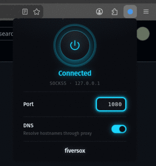

# fiversox

A tiny Firefox (MV3) extension that toggles Firefox’s proxy between:

- **Off**: no proxy
- **On**: manual **SOCKS v5** proxy at `localhost:<port>` (default `1080`)

Includes an optional **DNS** toggle (“Proxy DNS when using SOCKS v5”).

## What it changes

This extension **directly sets Firefox’s global proxy configuration** via `browser.proxy.settings`.

- Turning **On** overwrites whatever proxy settings you had.
- Turning **Off** sets “No proxy” (it does not restore previous settings).

## Install

[Install from Firefox Add-ons](https://addons.mozilla.org/en-US/firefox/addon/fiversox/)

## Install for development

[Developer notes](docs/dx.md)
  
## Contributors

  
  

